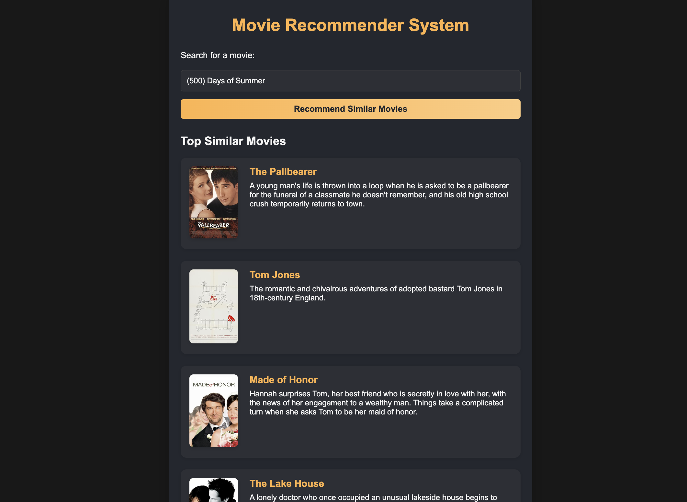
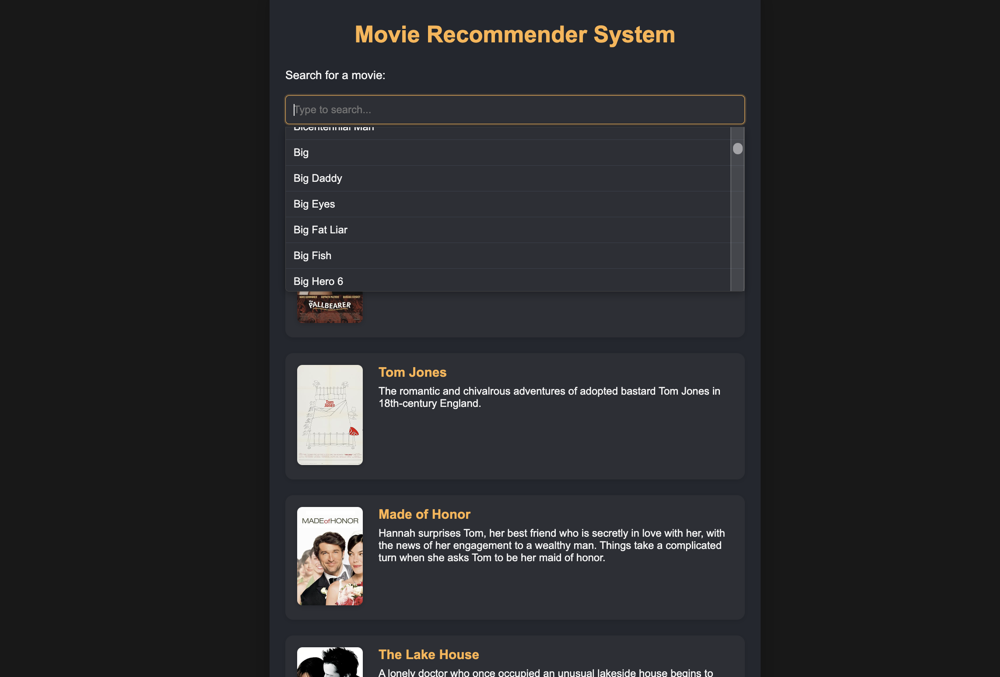

# Movie Recommender System

This project is a movie recommendation engine with a Python Flask API backend and a React front-end. The system uses content-based filtering for generating recommendations.

---

## Demo

---

## Prerequisites

Ensure you have Python 3.x and Node.js/npm installed.

---

## Setup Instructions

The application requires the backend and frontend to run concurrently in two separate terminal sessions.
Install first requirements : pip install -r requirements.txt

### 1. Backend (Python/Flask)

This server hosts the similarity model and the recommendation API.

Navigate to the backend directory: cd back
Run the process.py and then app.py

### 2. Frontend (React)

Go to the terminal : cd react.And instal npm : npm install.Then u can start npm : npm start.

